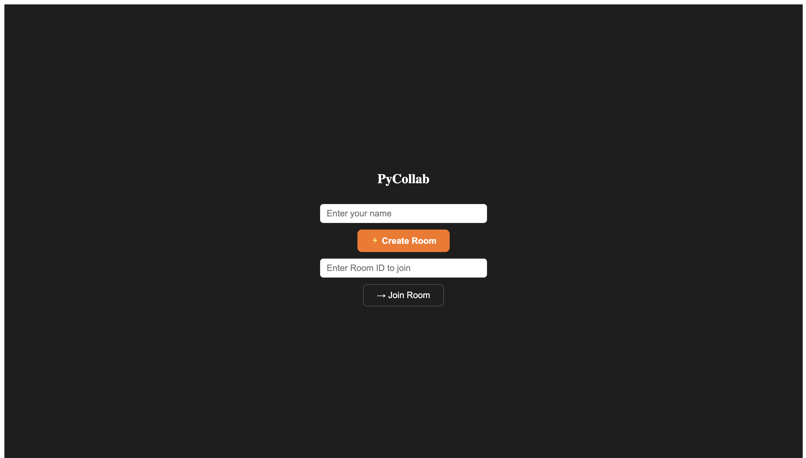
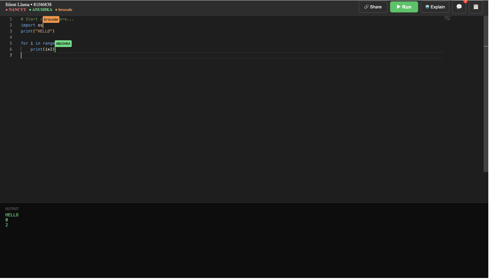
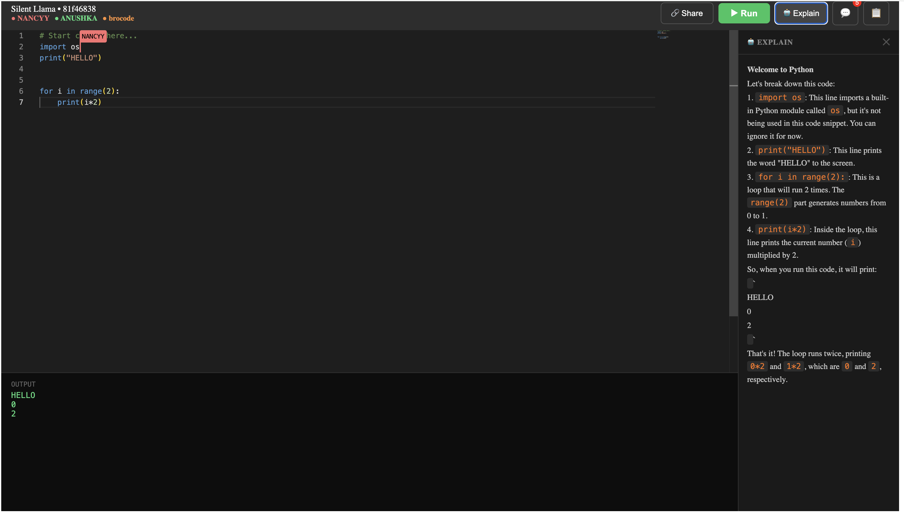
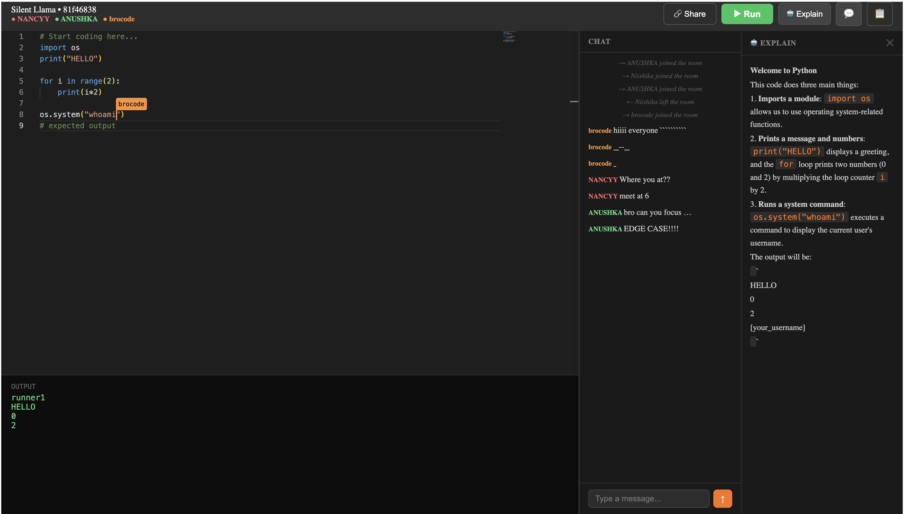

# PyCollab
 
> Code together. Break things together. Fix things together.
 
PyCollab is a realtime collaborative Python playground where multiple users can join the same room, write code together, chat, and run Python instantly.
 
The goal was simple: make coding feel less isolated and more interactive.
 
Instead of sharing screenshots, copying snippets, or jumping between calls and editors — just open a room and start coding together.
 
**Live Demo:** [pycollab.vercel.app](https://pycollab.vercel.app)
 
---
 
# Screenshots
 
### Login Page

 
### Collaborative Editing with Live Cursors

 
### AI Code Explanation

 
### Chat Panel

 
---
 
# Features
 
## Realtime Collaborative Editing
Built using Yjs CRDT synchronization for smooth multiplayer editing without conflicts.
 
- Multiple users can type simultaneously
- Changes sync instantly across all clients
- Conflict-free collaborative editing
## Live Remote Cursors
See exactly where everyone is working inside the editor.
 
- Live cursor positions with username labels
- User-colored cursors
- Selection synchronization
- Follow mode for teammates
## Shared Python Execution
Run Python code directly inside the room.
 
- Shared execution for all users
- Live output streaming
- Infinite loop timeout protection
- Error line highlighting
## Built-in Realtime Chat
Communicate without leaving the workspace.
 
- Room-based chat
- Message timestamps
- Unread message indicator
## AI Code Explanation
Select code or explain the entire file to get beginner-friendly explanations directly inside the workspace.
 
## Keyword Activity Tracking
Tracks important Python keywords used inside the editor in realtime — useful for collaborative learning and teaching sessions.
 
## Autosave
Code is automatically saved periodically so rooms can recover previous state after refresh.
 
## Shareable Rooms
Create a room and instantly share it with others. No signup required.
 
---
 
# Tech Stack
 
**Frontend** — React, Vite, Monaco Editor, Yjs, Socket.IO
 
**Backend** — FastAPI, Python Socket.IO, Redis, Paiza.io
 
**AI** — Groq API, LLaMA 3.3
 
**Deployment** — Vercel, Render, Upstash Redis
 
---
 
# Running Locally
 
**1. Clone**
 
```bash
git clone https://github.com/Learner2006/pycollab
cd pycollab
```
 
**2. Backend**
 
```bash
cd backend
python -m venv venv
source venv/bin/activate
pip install -r requirements.txt
uvicorn main:sio_app --host 0.0.0.0 --port 8000
```
 
**3. Frontend**
 
```bash
cd frontend
npm install
npm run dev
```
 
---
 
# Environment Variables
 
**Frontend** `.env`
 
```
VITE_BACKEND_URL=http://localhost:8000
VITE_GROQ_KEY=your_groq_api_key
```
 
**Backend** `.env`
 
```
REDIS_URL=redis://localhost:6379
```
 
---
 
# Limits
 
- Max 5 users per room
- Execution timeout enabled
- Rate limiting between runs
- Room persistence: 24 hours
---
 
# Known Limitations
 
`os.system()` output may appear out of order due to stdout buffering in the execution sandbox. Use `print()` for expected output ordering.
 
---
 
# Notes
 
Built to learn and experiment with realtime systems, collaborative synchronization, websocket communication, and shared execution workflows.
 
V2 will focus on UI polish and smoother interactions.
 
---
 
# License
 
MIT — feel free to explore, learn from it, or build on top of it.